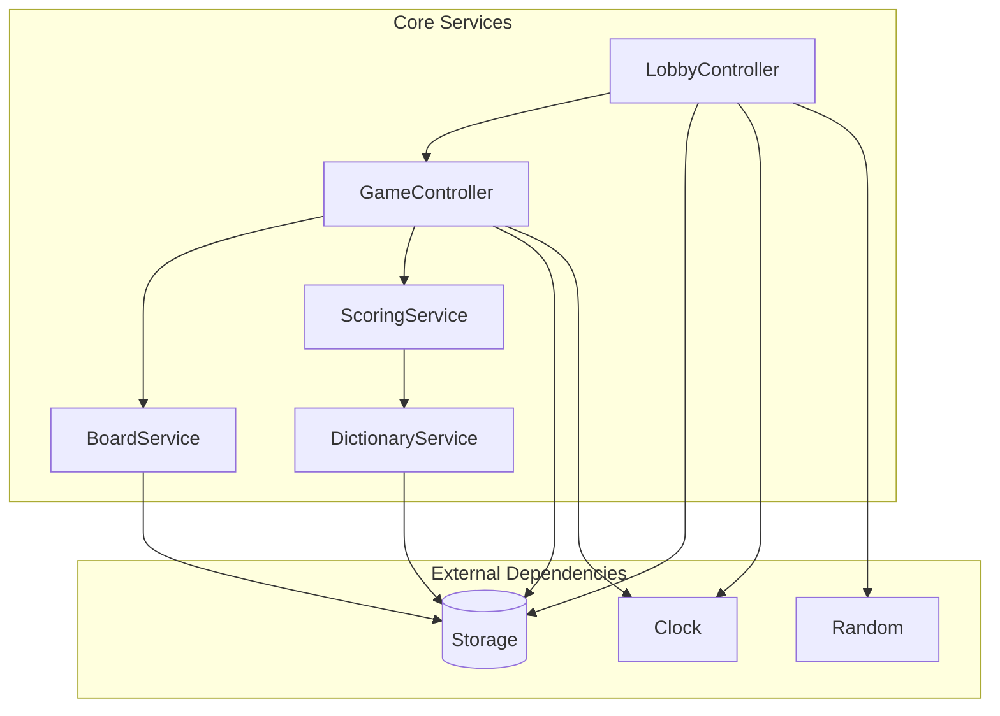
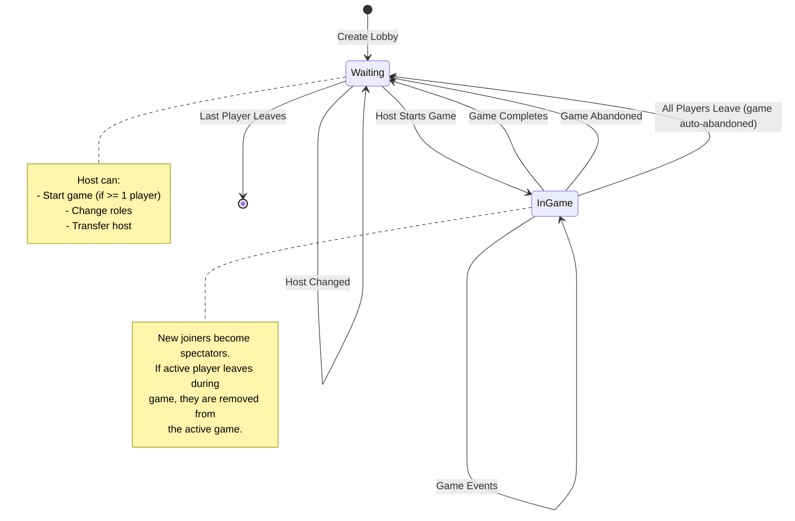
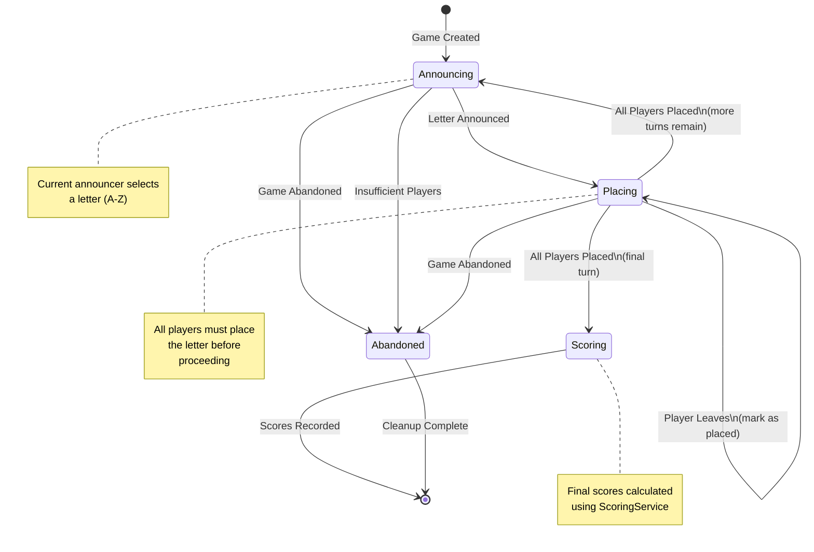
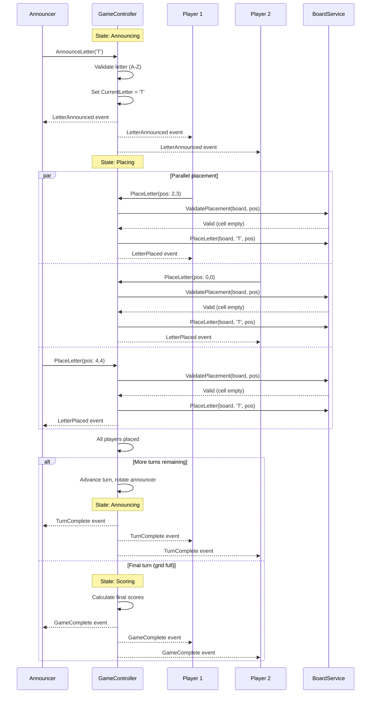
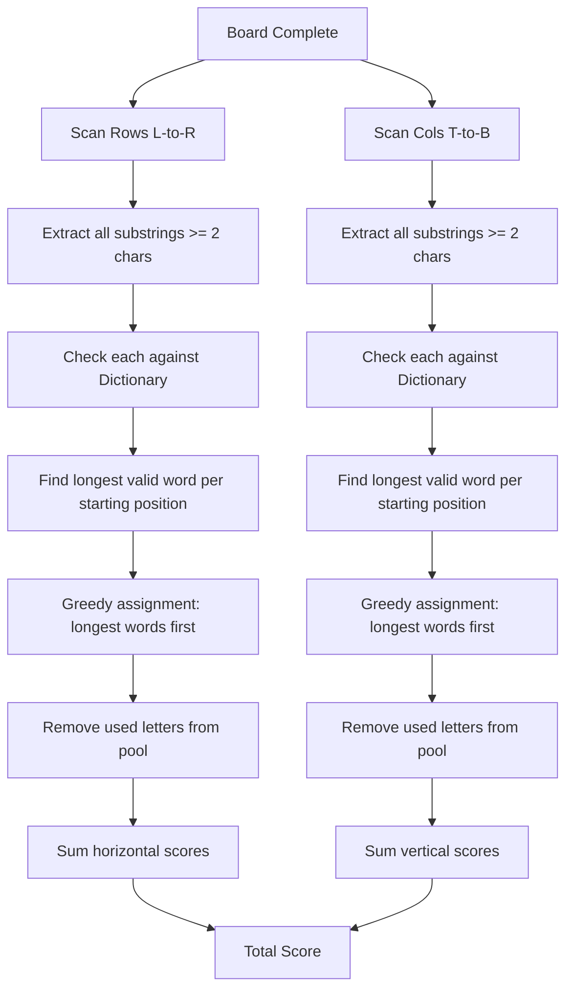
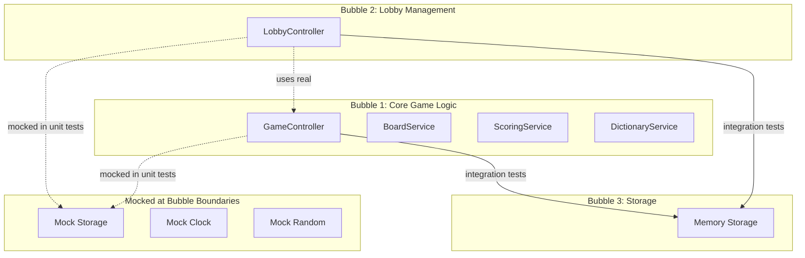

# spec-001 - Core Business Logic Architecture

## Overview

This specification defines the core business logic layer for the crossword game, including:

- Core data models (Player, Lobby, Game, Board)
- State machines for Lobby and Game lifecycle
- Turn flow and game mechanics
- Scoring algorithm
- Service architecture and dependencies

This spec focuses exclusively on the business logic layer. Interface concerns (HTTP handlers, templates, SSE) are out of scope and will be covered in separate specifications.

## Relevant context

- Design docs: `docs/design/game-design.md`, `docs/design/game-modelling.md`, `docs/design/code-design-tech-stack.md`
- We follow DI principles with services as structs containing dependencies
- External dependencies are wrapped in interfaces for testability
- We use large test bubbles, mocking only at boundaries

## Architecture Overview

### Package Structure

```
internal/
├── model/                    # Pure data structures (no logic)
│   ├── player.go
│   ├── lobby.go
│   ├── game.go
│   ├── board.go
│   └── events.go
├── services/
│   ├── dictionary/           # Dictionary/word validation service
│   │   ├── service.go
│   │   └── service_test.go
│   ├── scoring/              # Scoring calculation service
│   │   ├── service.go
│   │   └── service_test.go
│   ├── lobby/                # Lobby state management
│   │   ├── service.go
│   │   ├── service_test.go
│   │   └── controller.go     # Lobby state machine controller
│   ├── game/                 # Game state management
│   │   ├── service.go
│   │   ├── service_test.go
│   │   └── controller.go     # Game state machine controller
│   └── board/                # Board operations
│       ├── service.go
│       └── service_test.go
├── dependencies/
│   ├── clock/                # Time abstraction
│   ├── random/               # Random number generation
│   └── mocks/
├── storage/                  # Data persistence abstraction
│   ├── interface.go
│   └── memory/               # In-memory implementation
└── factory/
    ├── factory.go            # Production wiring
    └── test_factory.go       # Test wiring with mocks
```

### Component Dependency Diagram



## Core Models

### Player

```go
// model/player.go

// PlayerID uniquely identifies a player across the system
type PlayerID string

// Player represents a game participant
type Player struct {
    ID          PlayerID
    DisplayName string
    IsGuest     bool      // true for unregistered players
    CreatedAt   time.Time
}

// RegisteredPlayer extends Player with authentication data
// Stored separately for security (password never in memory with session)
type RegisteredPlayer struct {
    PlayerID     PlayerID
    Username     string    // login username (immutable)
    PasswordHash string    // bcrypt hash
    CreatedAt    time.Time
    UpdatedAt    time.Time
}
```

### Lobby

```go
// model/lobby.go

// LobbyCode is a human-readable identifier for joining lobbies
type LobbyCode string

// LobbyState represents the current state of a lobby
type LobbyState string

const (
    LobbyStateWaiting   LobbyState = "waiting"    // No game in progress
    LobbyStateInGame    LobbyState = "in_game"    // Game currently active
)

// LobbyMemberRole distinguishes players from spectators
type LobbyMemberRole string

const (
    RolePlayer    LobbyMemberRole = "player"
    RoleSpectator LobbyMemberRole = "spectator"
)

// LobbyMember represents a player's membership in a lobby
type LobbyMember struct {
    Player   Player
    Role     LobbyMemberRole
    IsHost   bool
    JoinedAt time.Time
}

// LobbyConfig holds configurable settings for games in this lobby
type LobbyConfig struct {
    GridSize int // Default 5, configurable
}

// Lobby represents a group of players who can play games together
type Lobby struct {
    Code        LobbyCode
    State       LobbyState
    Members     []LobbyMember     // All members (players + spectators)
    Config      LobbyConfig
    GameHistory []GameSummary     // Completed games
    CurrentGame *GameID           // nil when State is waiting
    CreatedAt   time.Time
    UpdatedAt   time.Time
}
```

### Game

```go
// model/game.go

// GameID uniquely identifies a game
type GameID string

// GameState represents the current phase of a game
type GameState string

const (
    GameStateAnnouncing GameState = "announcing" // Waiting for announcer to pick letter
    GameStatePlacing    GameState = "placing"    // Players placing the announced letter
    GameStateScoring    GameState = "scoring"    // Game complete, showing scores
    GameStateAbandoned  GameState = "abandoned"  // Game was cancelled
)

// TurnPhase provides finer detail within a game state
type TurnPhase string

const (
    TurnPhaseAwaitingLetter    TurnPhase = "awaiting_letter"
    TurnPhaseAwaitingPlacement TurnPhase = "awaiting_placement"
)

// Game represents a single instance of the crossword game
type Game struct {
    ID            GameID
    LobbyCode     LobbyCode
    State         GameState
    GridSize      int

    // Players in this game (snapshot at game start)
    Players       []PlayerID

    // Turn management
    CurrentTurn   int           // 0-indexed turn number
    AnnouncerIdx  int           // Index into Players for current announcer
    CurrentLetter rune          // The letter announced this turn (0 if awaiting)

    // Placement tracking for current turn
    Placements    map[PlayerID]bool // Which players have placed this turn

    // Timing
    TurnStartedAt time.Time
    CreatedAt     time.Time
    UpdatedAt     time.Time
}

// GameSummary is a lightweight record of a completed game
type GameSummary struct {
    ID          GameID
    FinalScores map[PlayerID]int
    Winner      PlayerID     // Empty if tie
    CompletedAt time.Time
}
```

### Board

```go
// model/board.go

// Cell represents a single square on the board
type Cell struct {
    Letter rune // 0 (zero value) means empty
}

// Position identifies a cell on the board
type Position struct {
    Row int // 0-indexed from top
    Col int // 0-indexed from left
}

// Board represents a player's grid for a specific game
type Board struct {
    GameID   GameID
    PlayerID PlayerID
    Size     int      // Grid dimension (e.g., 5 for 5x5)
    Cells    [][]Cell // Row-major: Cells[row][col]
}

// WordMatch represents a valid word found on the board
type WordMatch struct {
    Word       string
    StartPos   Position
    Horizontal bool     // true = left-to-right, false = top-to-bottom
    Length     int
    Score      int      // Calculated score for this word
}

// BoardScore is the complete scoring result for a board
type BoardScore struct {
    PlayerID    PlayerID
    Words       []WordMatch
    TotalScore  int
}
```

### Events

```go
// model/events.go

// Event types for state transitions and notifications

type EventType string

const (
    // Lobby events
    EventPlayerJoined     EventType = "player_joined"
    EventPlayerLeft       EventType = "player_left"
    EventHostChanged      EventType = "host_changed"
    EventRoleChanged      EventType = "role_changed"
    EventGameStarted      EventType = "game_started"
    EventGameEnded        EventType = "game_ended"

    // Game events
    EventLetterAnnounced  EventType = "letter_announced"
    EventLetterPlaced     EventType = "letter_placed"
    EventTurnComplete     EventType = "turn_complete"
    EventGameComplete     EventType = "game_complete"
    EventGameAbandoned    EventType = "game_abandoned"
)

// Event is the base structure for all events
type Event struct {
    Type      EventType
    Timestamp time.Time
    LobbyCode LobbyCode
    GameID    GameID       // Empty for lobby-only events
    PlayerID  PlayerID     // The player who triggered or is affected
    Payload   interface{}  // Type-specific data
}
```

## State Machines

### Lobby State Machine



### Game State Machine



### Turn Flow Sequence



## Scoring Algorithm

### Word Identification Flow



### Scoring Rules (from design)

1. Each letter may only be used **once per direction**
   - Same letter can score in both horizontal AND vertical words
   - Same letter cannot be in two overlapping horizontal words

2. Words must be:
   - Valid dictionary words
   - At least 2 letters long

3. Scoring:
   - Base score = word length
   - Full row/column bonus: double points (e.g., 5-letter word in 5x5 grid = 10 points)

### Scoring Algorithm Pseudocode

```
function ScoreBoard(board, dictionary):
    horizontalWords = findBestWords(board, HORIZONTAL, dictionary)
    verticalWords = findBestWords(board, VERTICAL, dictionary)

    totalScore = 0
    for word in horizontalWords + verticalWords:
        score = len(word)
        if len(word) == board.size:
            score = score * 2  // Full row/column bonus
        totalScore += score

    return BoardScore{
        Words: horizontalWords + verticalWords,
        TotalScore: totalScore
    }

function findBestWords(board, direction, dictionary):
    // For each row (or column), find the best non-overlapping set of words
    // Using greedy approach: prefer longer words

    result = []
    for line in getLines(board, direction):
        usedPositions = set()
        candidates = findAllValidWords(line, dictionary)

        // Sort by length descending
        sort(candidates, by: length, descending: true)

        for candidate in candidates:
            if not overlaps(candidate.positions, usedPositions):
                result.append(candidate)
                usedPositions.addAll(candidate.positions)

    return result
```

## Service Interfaces

### DictionaryService

```go
type DictionaryService interface {
    // IsValidWord checks if a word exists in the dictionary
    IsValidWord(word string) bool

    // LoadDictionary initializes the dictionary from storage
    LoadDictionary(ctx context.Context) error
}
```

### ScoringService

```go
type ScoringService interface {
    // ScoreBoard calculates the final score for a completed board
    ScoreBoard(board *model.Board) (*model.BoardScore, error)
}
```

### BoardService

```go
type BoardService interface {
    // CreateBoard initializes an empty board for a player
    CreateBoard(gameID model.GameID, playerID model.PlayerID, size int) (*model.Board, error)

    // GetBoard retrieves a player's board
    GetBoard(gameID model.GameID, playerID model.PlayerID) (*model.Board, error)

    // PlaceLetter places a letter at the specified position
    PlaceLetter(board *model.Board, letter rune, pos model.Position) error

    // IsFull checks if all cells are filled
    IsFull(board *model.Board) bool

    // ValidatePlacement checks if a position is valid and empty
    ValidatePlacement(board *model.Board, pos model.Position) error
}
```

### GameController

```go
type GameController interface {
    // CreateGame initializes a new game within a lobby
    CreateGame(ctx context.Context, lobbyCode model.LobbyCode, players []model.PlayerID, gridSize int) (*model.Game, error)

    // AnnounceLetter handles the announcer selecting a letter
    AnnounceLetter(ctx context.Context, gameID model.GameID, playerID model.PlayerID, letter rune) error

    // PlaceLetter handles a player placing the current letter
    PlaceLetter(ctx context.Context, gameID model.GameID, playerID model.PlayerID, pos model.Position) error

    // AbandonGame ends a game prematurely
    AbandonGame(ctx context.Context, gameID model.GameID) error

    // RemovePlayer handles a player leaving mid-game
    RemovePlayer(ctx context.Context, gameID model.GameID, playerID model.PlayerID) error

    // GetGame retrieves current game state
    GetGame(ctx context.Context, gameID model.GameID) (*model.Game, error)

    // GetGameState returns player-specific view of game state
    // (hides other players' boards for active players)
    GetGameState(ctx context.Context, gameID model.GameID, forPlayer model.PlayerID) (*GameStateView, error)
}
```

### LobbyController

```go
type LobbyController interface {
    // CreateLobby creates a new lobby with the creator as host
    CreateLobby(ctx context.Context, host model.Player) (*model.Lobby, error)

    // JoinLobby adds a player to an existing lobby
    JoinLobby(ctx context.Context, code model.LobbyCode, player model.Player) error

    // LeaveLobby removes a player from a lobby
    LeaveLobby(ctx context.Context, code model.LobbyCode, playerID model.PlayerID) error

    // SetRole changes a member's role (player/spectator)
    SetRole(ctx context.Context, code model.LobbyCode, playerID model.PlayerID, role model.LobbyMemberRole) error

    // TransferHost makes another member the host
    TransferHost(ctx context.Context, code model.LobbyCode, newHostID model.PlayerID) error

    // StartGame begins a new game with current players
    StartGame(ctx context.Context, code model.LobbyCode, requestingPlayer model.PlayerID) (*model.Game, error)

    // AbandonGame ends the current game
    AbandonGame(ctx context.Context, code model.LobbyCode, requestingPlayer model.PlayerID) error

    // GetLobby retrieves lobby state
    GetLobby(ctx context.Context, code model.LobbyCode) (*model.Lobby, error)

    // UpdateConfig updates lobby configuration
    UpdateConfig(ctx context.Context, code model.LobbyCode, config model.LobbyConfig) error
}
```

### Storage Interface

```go
type Storage interface {
    // Player operations
    SavePlayer(ctx context.Context, player *model.Player) error
    GetPlayer(ctx context.Context, id model.PlayerID) (*model.Player, error)

    // Registered player operations
    SaveRegisteredPlayer(ctx context.Context, rp *model.RegisteredPlayer) error
    GetRegisteredPlayerByUsername(ctx context.Context, username string) (*model.RegisteredPlayer, error)

    // Lobby operations
    SaveLobby(ctx context.Context, lobby *model.Lobby) error
    GetLobby(ctx context.Context, code model.LobbyCode) (*model.Lobby, error)
    DeleteLobby(ctx context.Context, code model.LobbyCode) error

    // Game operations
    SaveGame(ctx context.Context, game *model.Game) error
    GetGame(ctx context.Context, id model.GameID) (*model.Game, error)

    // Board operations
    SaveBoard(ctx context.Context, board *model.Board) error
    GetBoard(ctx context.Context, gameID model.GameID, playerID model.PlayerID) (*model.Board, error)
    GetBoardsForGame(ctx context.Context, gameID model.GameID) ([]*model.Board, error)

    // Dictionary operations
    GetDictionaryWords(ctx context.Context) ([]string, error)
}
```

## Test Bubble Strategy



**Bubble Definitions:**

1. **Core Game Logic Bubble**: GameController, BoardService, ScoringService, DictionaryService
   - These are tested together as a unit
   - Storage is mocked at this boundary
   - Clock/Random are mocked for determinism

2. **Lobby Management Bubble**: LobbyController
   - Uses real GameController (bubbles overlap here intentionally)
   - Storage is mocked at this boundary

3. **Storage Bubble**: Memory storage implementation
   - Tested separately with its own unit tests
   - Integration tests verify the full stack

## Task implementation strategy

1. **Implement core models** (`internal/model/`)
   - Define all data structures as specified above
   - No logic, just pure data types

2. **Implement storage interface and memory implementation** (`internal/storage/`)
   - Define the storage interface
   - Implement in-memory storage with proper concurrency handling
   - Write unit tests for storage operations

3. **Implement DictionaryService** (`internal/services/dictionary/`)
   - Load dictionary from file
   - Implement efficient word lookup (trie or map)
   - Write unit tests

4. **Implement BoardService** (`internal/services/board/`)
   - Cell placement and validation
   - Board state queries
   - Write unit tests

5. **Implement ScoringService** (`internal/services/scoring/`)
   - Word identification algorithm
   - Greedy word selection with letter usage tracking
   - Score calculation with full-line bonus
   - Comprehensive unit tests for scoring edge cases

6. **Implement GameController** (`internal/services/game/`)
   - Game state machine
   - Turn management
   - Integration with Board and Scoring services
   - Unit tests with mocked storage

7. **Implement LobbyController** (`internal/services/lobby/`)
   - Lobby state machine
   - Member management
   - Game lifecycle orchestration
   - Unit tests with mocked storage

8. **Implement external dependencies** (`internal/dependencies/`)
   - Clock interface and real/mock implementations
   - Random interface for lobby code generation
   - Write mock implementations for testing

9. **Implement factory wiring** (`internal/factory/`)
   - Production factory with real dependencies
   - Test factory with mock injection

10. **Write integration tests**
    - Full flow tests using memory storage
    - Test complete game scenarios

## Status details

Status: ACTIVE - All tasks complete.

### Completed:
- [x] Task 1: Core models (`internal/model/`)
- [x] Task 2: Storage interface + memory implementation (with tests)
- [x] Task 3: DictionaryService (with tests)
- [x] Task 4: BoardService (with tests)
- [x] Task 5: ScoringService (with tests)
- [x] Task 6: External dependencies (clock, random, mocks)
- [x] Task 7: GameController (with tests)
- [x] Task 8: LobbyController (with tests)
- [x] Task 9: Factory wiring
- [x] Task 10: Integration tests

### Test Summary:
- 7 test suites, all passing
- Unit tests: storage (13), dictionary (10), board (17), scoring (15), game (28), lobby (29)
- Integration tests: 7 full-flow scenarios
