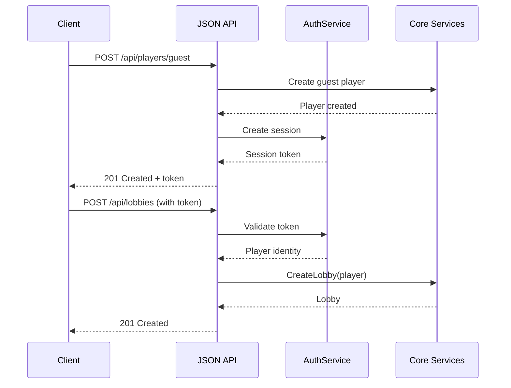

# spec-002 - JSON API Layer

## Overview

This specification defines a JSON API layer that exposes the core game logic for programmatic access. The API enables:

- Automated testing of game flows
- CLI-based game interaction
- Potential future mobile/native clients

The API layer is deliberately thin, delegating all business logic to the core services defined in spec-001.

## Relevant context

- Depends on: spec-001 (Core Business Logic)
- The web interface (HTMX) will be implemented separately but will share the same core services
- We use gorilla/mux for routing and session handling
- Authentication uses session tokens stored in cookies or Authorization headers

## Design Principles

1. **Thin API layer**: Handlers only handle HTTP concerns (parsing, validation, response formatting)
2. **Consistent error responses**: All errors follow a standard format
3. **RESTful design**: Resources map to nouns, actions to HTTP methods
4. **Stateless requests**: Session token provides identity, no server-side request state

## Authentication

### Session Management

Players authenticate via sessions. A session is created when:
- A guest player is created (anonymous session)
- A registered player logs in

Sessions are identified by a token that can be provided via:
- `Authorization: Bearer <token>` header (preferred for API clients)
- `session` cookie (for browser-based access)

### Session Flow



## API Structure

### Base URL

All endpoints are prefixed with `/api/v1/`.

### Resources

| Resource | Description |
|----------|-------------|
| `/players` | Player identity management |
| `/lobbies` | Lobby lifecycle and membership |
| `/lobbies/{code}/game` | Current game within a lobby |

## Endpoints

### Players

#### Create Guest Player
```
POST /api/v1/players/guest
```

Creates an anonymous player session.

**Request:**
```json
{
  "display_name": "Alice"
}
```

**Response (201):**
```json
{
  "player": {
    "id": "p_abc123",
    "display_name": "Alice",
    "is_guest": true
  },
  "session_token": "sess_xyz789"
}
```

#### Register Player
```
POST /api/v1/players/register
```

Creates a registered player account.

**Request:**
```json
{
  "username": "alice",
  "password": "secretpassword",
  "display_name": "Alice"
}
```

**Response (201):**
```json
{
  "player": {
    "id": "p_abc123",
    "display_name": "Alice",
    "is_guest": false
  },
  "session_token": "sess_xyz789"
}
```

#### Login
```
POST /api/v1/players/login
```

**Request:**
```json
{
  "username": "alice",
  "password": "secretpassword"
}
```

**Response (200):**
```json
{
  "player": {
    "id": "p_abc123",
    "display_name": "Alice",
    "is_guest": false
  },
  "session_token": "sess_xyz789"
}
```

#### Get Current Player
```
GET /api/v1/players/me
```

Returns the authenticated player's information.

**Response (200):**
```json
{
  "id": "p_abc123",
  "display_name": "Alice",
  "is_guest": false
}
```

### Lobbies

#### Create Lobby
```
POST /api/v1/lobbies
```

Creates a new lobby with the authenticated player as host.

**Request:**
```json
{
  "grid_size": 5
}
```

**Response (201):**
```json
{
  "code": "ABC123",
  "state": "waiting",
  "config": {
    "grid_size": 5
  },
  "members": [
    {
      "player_id": "p_abc123",
      "display_name": "Alice",
      "role": "player",
      "is_host": true
    }
  ],
  "current_game": null
}
```

#### Get Lobby
```
GET /api/v1/lobbies/{code}
```

**Response (200):**
```json
{
  "code": "ABC123",
  "state": "waiting",
  "config": {
    "grid_size": 5
  },
  "members": [...],
  "current_game": null,
  "game_history": []
}
```

#### Join Lobby
```
POST /api/v1/lobbies/{code}/join
```

**Response (200):**
```json
{
  "code": "ABC123",
  "state": "waiting",
  ...
}
```

#### Leave Lobby
```
POST /api/v1/lobbies/{code}/leave
```

**Response (204 No Content)**

#### Update Lobby Config
```
PATCH /api/v1/lobbies/{code}/config
```

Host only.

**Request:**
```json
{
  "grid_size": 7
}
```

**Response (200):**
```json
{
  "grid_size": 7
}
```

#### Set Member Role
```
PATCH /api/v1/lobbies/{code}/members/{player_id}/role
```

Host only. Cannot change roles during a game.

**Request:**
```json
{
  "role": "spectator"
}
```

**Response (204 No Content)**

#### Transfer Host
```
POST /api/v1/lobbies/{code}/transfer-host
```

Host only.

**Request:**
```json
{
  "new_host_id": "p_def456"
}
```

**Response (204 No Content)**

### Game

#### Start Game
```
POST /api/v1/lobbies/{code}/game
```

Host only. Starts a new game with current players.

**Response (201):**
```json
{
  "id": "g_abc123",
  "state": "announcing",
  "grid_size": 5,
  "players": ["p_abc123", "p_def456"],
  "current_turn": 0,
  "current_announcer": "p_abc123",
  "current_letter": null
}
```

#### Get Game State
```
GET /api/v1/lobbies/{code}/game
```

Returns the current game state. Board visibility depends on role:
- Players see only their own board during the game
- Spectators see all boards
- After game completion, all boards are visible

**Response (200):**
```json
{
  "id": "g_abc123",
  "state": "placing",
  "grid_size": 5,
  "players": ["p_abc123", "p_def456"],
  "current_turn": 3,
  "current_announcer": "p_def456",
  "current_letter": "T",
  "placements": {
    "p_abc123": true,
    "p_def456": false
  },
  "my_board": {
    "cells": [
      ["C", "A", "T", null, null],
      [null, null, null, null, null],
      ...
    ]
  },
  "all_boards": null
}
```

#### Announce Letter
```
POST /api/v1/lobbies/{code}/game/announce
```

Current announcer only.

**Request:**
```json
{
  "letter": "T"
}
```

**Response (200):**
```json
{
  "state": "placing",
  "current_letter": "T"
}
```

#### Place Letter
```
POST /api/v1/lobbies/{code}/game/place
```

**Request:**
```json
{
  "row": 2,
  "col": 3
}
```

**Response (200):**
```json
{
  "placed": true,
  "board": {
    "cells": [...]
  },
  "turn_complete": false
}
```

If this placement completes the turn:
```json
{
  "placed": true,
  "board": {...},
  "turn_complete": true,
  "game_complete": false,
  "next_announcer": "p_abc123"
}
```

If this placement completes the game:
```json
{
  "placed": true,
  "board": {...},
  "turn_complete": true,
  "game_complete": true,
  "scores": [
    {
      "player_id": "p_abc123",
      "total_score": 24,
      "words": [
        {"word": "CAT", "score": 6, "row": 0, "col": 0, "horizontal": true}
      ]
    }
  ],
  "winner": "p_abc123"
}
```

#### Abandon Game
```
DELETE /api/v1/lobbies/{code}/game
```

Host only.

**Response (204 No Content)**

## Error Responses

All errors follow a consistent format:

```json
{
  "error": {
    "code": "LOBBY_NOT_FOUND",
    "message": "Lobby with code 'XYZ999' not found"
  }
}
```

### Error Codes

| HTTP Status | Code | Description |
|-------------|------|-------------|
| 400 | `INVALID_REQUEST` | Malformed request body |
| 400 | `INVALID_LETTER` | Letter must be A-Z |
| 400 | `INVALID_POSITION` | Position out of bounds |
| 401 | `UNAUTHORIZED` | Missing or invalid session |
| 403 | `NOT_HOST` | Action requires host privileges |
| 403 | `NOT_YOUR_TURN` | Not the current announcer |
| 403 | `ALREADY_PLACED` | Already placed this turn |
| 404 | `PLAYER_NOT_FOUND` | Player does not exist |
| 404 | `LOBBY_NOT_FOUND` | Lobby does not exist |
| 404 | `GAME_NOT_FOUND` | No active game |
| 409 | `ALREADY_IN_LOBBY` | Player already in this lobby |
| 409 | `GAME_IN_PROGRESS` | Cannot perform action during game |
| 409 | `NO_GAME_IN_PROGRESS` | No game to perform action on |
| 409 | `CELL_OCCUPIED` | Board cell already has a letter |
| 422 | `INSUFFICIENT_PLAYERS` | Need at least one player |

## Package Structure

```
internal/
├── api/
│   ├── handler/           # HTTP handlers
│   │   ├── player.go
│   │   ├── lobby.go
│   │   ├── game.go
│   │   └── errors.go
│   ├── middleware/        # HTTP middleware
│   │   ├── auth.go
│   │   ├── logging.go
│   │   └── recovery.go
│   ├── request/           # Request DTOs
│   │   └── types.go
│   ├── response/          # Response DTOs
│   │   └── types.go
│   ├── router.go          # Route definitions
│   └── server.go          # HTTP server setup
├── services/
│   └── auth/              # Session/auth service
│       ├── service.go
│       └── service_test.go
```

## Request/Response Mapping

Handlers map between HTTP and core services:

```go
// Example: thin handler delegating to core service
func (h *LobbyHandler) CreateLobby(w http.ResponseWriter, r *http.Request) {
    // 1. Get player from context (set by auth middleware)
    player := middleware.GetPlayer(r.Context())

    // 2. Parse request
    var req request.CreateLobbyRequest
    if err := json.NewDecoder(r.Body).Decode(&req); err != nil {
        response.Error(w, errors.InvalidRequest(err))
        return
    }

    // 3. Delegate to core service
    lobby, err := h.lobbyController.CreateLobby(r.Context(), player)
    if err != nil {
        response.Error(w, errors.FromModel(err))
        return
    }

    // 4. Update config if provided
    if req.GridSize > 0 {
        cfg := model.LobbyConfig{GridSize: req.GridSize}
        h.lobbyController.UpdateConfig(r.Context(), lobby.Code, player.ID, cfg)
    }

    // 5. Return response
    response.JSON(w, http.StatusCreated, response.LobbyFromModel(lobby))
}
```

## Task implementation strategy

1. **Implement AuthService** (`internal/services/auth/`)
   - Session token generation and validation
   - Password hashing for registered players
   - Unit tests

2. **Define request/response types** (`internal/api/request/`, `internal/api/response/`)
   - DTOs for all endpoints
   - Conversion functions to/from model types

3. **Implement error handling** (`internal/api/handler/errors.go`)
   - Error code mapping from model errors
   - Standard error response format

4. **Implement middleware** (`internal/api/middleware/`)
   - Auth middleware for session validation
   - Logging middleware
   - Recovery middleware

5. **Implement handlers** (`internal/api/handler/`)
   - Player handlers
   - Lobby handlers
   - Game handlers
   - Unit tests with mocked services

6. **Implement router and server** (`internal/api/`)
   - Route registration
   - Server configuration

7. **Add API integration tests**
   - Full flow tests via HTTP

8. **Write OpenAPI specification**
   - Document all endpoints
   - Add to `docs/api/`

## Status details

Status: DONE - All tasks completed:
1. AuthService - Complete with session management and password hashing
2. Request/Response types - DTOs for all endpoints with model conversion functions
3. Error handling - Centralized error handling with model and auth error mapping
4. Middleware - Auth, logging, and recovery middleware
5. Handlers - Player, lobby, and game handlers
6. Router and server - Full route registration with gorilla/mux
7. Integration tests - 10 API tests covering full game flow
