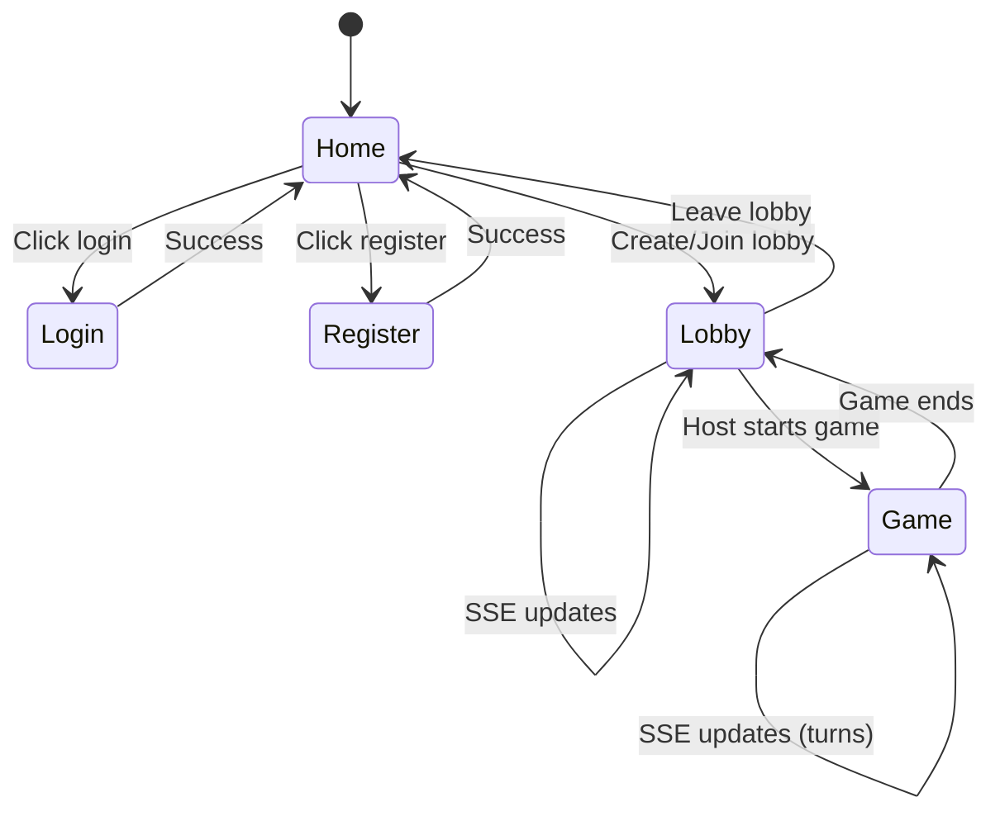
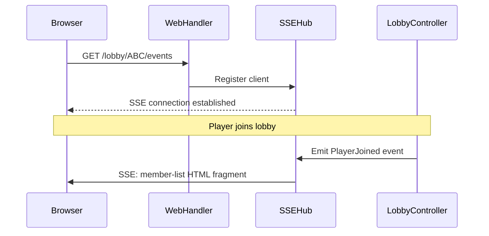

# spec-003 - Web Interface API

## Overview

This specification defines the HTML hypermedia web interface for the crossword game. Following the principles in our design docs, the web interface:

- Uses **Templ** for server-side HTML template rendering
- Uses **HTMX** for progressive enhancement, enabling dynamic interactions without a thick client
- Uses **SSE (Server-Sent Events)** for real-time game state updates via the HTMX SSE extension
- Shares the same core services as the JSON API (spec-002)

The web interface provides a complete browser-based experience for playing the crossword game, from player creation through lobby management to game play.

## Relevant context

- Depends on: spec-001 (Core Business Logic), spec-002 (JSON API for auth patterns)
- Design docs: `docs/design/code-design-tech-stack.md` (tech stack), `docs/design/game-modelling.md` (flow)
- The existing event model in `internal/model/events.go` provides the foundation for SSE updates
- Authentication uses session cookies, leveraging the existing `AuthService`

## Design Principles

1. **Hypermedia-driven**: The server returns HTML, not JSON. State lives on the server; the browser renders what it receives.
2. **Progressive enhancement**: Core functionality works without JavaScript; HTMX enhances the experience.
3. **Real-time via SSE**: Game events are pushed to clients via SSE; HTMX swaps in updated HTML fragments.
4. **Thin view layer**: Templates render data; all logic lives in core services.
5. **Graceful degradation**: If SSE disconnects, the UI provides manual refresh options.

## Page Structure

### Routes

| Route | Description |
|-------|-------------|
| `GET /` | Home page - create guest/login or create/join lobby |
| `GET /login` | Login form for registered players |
| `GET /register` | Registration form |
| `POST /auth/guest` | Create guest session (redirects to home) |
| `POST /auth/login` | Login (redirects to home or previous page) |
| `POST /auth/register` | Register (redirects to home) |
| `POST /auth/logout` | Logout (redirects to home) |
| `GET /lobby/{code}` | Lobby view - member list, config, game controls |
| `POST /lobby` | Create new lobby (redirects to lobby view) |
| `POST /lobby/{code}/join` | Join lobby (redirects to lobby view) |
| `GET /lobby/{code}/game` | Game view - board, turn info, scores |

### Page Flow



## Templ Template Structure

Templates are organized by page/component:

```
internal/web/
├── templates/
│   ├── layout/
│   │   ├── base.templ         # Base HTML layout (head, body wrapper)
│   │   └── nav.templ          # Navigation component
│   ├── pages/
│   │   ├── home.templ         # Home page
│   │   ├── login.templ        # Login form
│   │   ├── register.templ     # Registration form
│   │   ├── lobby.templ        # Lobby page
│   │   └── game.templ         # Game page
│   ├── components/
│   │   ├── lobby_members.templ    # Member list (SSE swappable)
│   │   ├── lobby_config.templ     # Config panel
│   │   ├── lobby_controls.templ   # Host controls
│   │   ├── game_board.templ       # Player's board grid
│   │   ├── game_status.templ      # Turn/announcer info
│   │   ├── game_letter_picker.templ # Letter selection (announcer only)
│   │   ├── game_scores.templ      # Final scores
│   │   └── error.templ            # Error display
│   └── partials/
│       ├── flash.templ            # Flash message display
│       └── player_badge.templ     # Player name/role badge
├── handler/
│   ├── home.go
│   ├── auth.go
│   ├── lobby.go
│   └── game.go
├── sse/
│   ├── hub.go                 # SSE connection hub
│   ├── client.go              # SSE client connection
│   └── events.go              # Event to HTML fragment mapping
├── static/
│   └── css/
│       └── styles.css         # Minimal CSS
└── router.go                  # Web route definitions
```

## HTMX Interaction Patterns

### Form Submissions

Forms use `hx-post` to submit without full page reload:

```html
<form hx-post="/lobby" hx-target="body" hx-push-url="true">
  <input type="text" name="grid_size" value="5">
  <button type="submit">Create Lobby</button>
</form>
```

### Partial Updates

Components include `hx-swap-oob="true"` for out-of-band swaps triggered by SSE:

```html
<div id="member-list" hx-swap-oob="true">
  <!-- Updated member list HTML -->
</div>
```

### SSE Connection

Pages requiring live updates include the SSE extension:

```html
<div hx-ext="sse" sse-connect="/lobby/{code}/events" sse-swap="message">
  <div id="lobby-content">
    <!-- Content updated via SSE -->
  </div>
</div>
```

## SSE Event System

### Connection Model

Each lobby has an SSE hub that manages client connections. When a player views a lobby or game page, they connect to the SSE endpoint and receive events for that lobby.



### Event to Fragment Mapping

Model events are transformed into HTML fragments for SSE delivery:

| Model Event | SSE Event Name | Target Element | Description |
|-------------|---------------|----------------|-------------|
| `player_joined` | `member-update` | `#member-list` | Re-render member list |
| `player_left` | `member-update` | `#member-list` | Re-render member list |
| `host_changed` | `lobby-update` | `#lobby-controls` | Update host controls visibility |
| `role_changed` | `member-update` | `#member-list` | Re-render member list |
| `game_started` | `game-started` | `body` | Redirect/swap to game view |
| `letter_announced` | `turn-update` | `#game-status` | Show current letter, enable placement |
| `letter_placed` | `placement-update` | `#placement-status` | Update who has placed |
| `turn_complete` | `turn-update` | `#game-status` | Next announcer, reset placement |
| `game_complete` | `game-complete` | `#game-content` | Show scores, winner |
| `game_abandoned` | `game-abandoned` | `body` | Redirect to lobby |

### SSE Message Format

SSE messages contain HTML fragments with swap instructions:

```
event: member-update
data: <div id="member-list" hx-swap-oob="true">...updated HTML...</div>

event: turn-update
data: <div id="game-status" hx-swap-oob="true">...updated HTML...</div>
```

### Connection Lifecycle

1. **Connect**: Browser opens SSE connection on page load
2. **Heartbeat**: Server sends periodic `:keepalive` comments to prevent timeout
3. **Reconnect**: HTMX SSE extension auto-reconnects on disconnect
4. **Cleanup**: Server removes client from hub when connection closes

## Game Board Interaction

### Board Display

The board is rendered as a grid. During the `placing` phase, empty cells are clickable:

```html
<div id="game-board" class="board grid-5">
  <button class="cell" hx-post="/lobby/ABC/game/place"
          hx-vals='{"row":0,"col":0}' hx-swap="none">
    <!-- empty, clickable -->
  </button>
  <div class="cell filled">C</div>
  <!-- ... -->
</div>
```

### Placement Flow

1. Announcer announces a letter via form submission
2. SSE broadcasts `letter_announced` to all clients
3. Game status updates to show current letter
4. Empty board cells become clickable for placement
5. Player clicks cell, `hx-post` submits placement
6. Server validates and places letter
7. SSE broadcasts `letter_placed` to update placement status
8. When all players have placed, `turn_complete` triggers next turn

### Spectator View

Spectators see all player boards (read-only) rendered in a grid layout. They receive all SSE events but cannot interact with game controls.

## Authentication Integration

### Session Cookie Flow

The web interface uses the same session tokens as the JSON API, stored in cookies:

```go
// After creating guest or logging in
http.SetCookie(w, &http.Cookie{
    Name:     "session",
    Value:    sessionToken,
    Path:     "/",
    HttpOnly: true,
    SameSite: http.SameSiteLaxMode,
})
```

### Auth Middleware

Web routes use auth middleware that:
1. Checks for `session` cookie
2. Validates session via `AuthService`
3. Adds player to request context
4. For unauthenticated users: redirects to login (for protected pages) or continues (for public pages)

### Protected vs Public Routes

| Type | Routes | Behavior if unauthenticated |
|------|--------|---------------------------|
| Public | `/`, `/login`, `/register` | Show page with guest/login options |
| Auth actions | `/auth/*` | Process form (create session) |
| Protected | `/lobby/*` | Redirect to `/login?next=/lobby/...` |

## Static Assets

### CSS Strategy

Minimal CSS for layout and game board styling. No CSS framework dependency. Styles focus on:
- Responsive grid layout for game board
- Visual feedback for interactive elements
- Clear distinction between player/spectator views
- Mobile-friendly touch targets

### JavaScript

Only HTMX and the SSE extension are included. No custom JavaScript unless absolutely necessary.

```html
<script src="https://unpkg.com/htmx.org@1.9.10"></script>
<script src="https://unpkg.com/htmx.org@1.9.10/dist/ext/sse.js"></script>
```

## Error Handling

### Form Validation Errors

Validation errors are returned as HTML with error messages displayed inline:

```html
<form hx-post="/auth/register" hx-target="#register-form" hx-swap="outerHTML">
  <div class="error">Username already taken</div>
  <!-- Form fields with values preserved -->
</form>
```

### Flash Messages

One-time messages (success, error) stored in session, displayed on next page load:

```html
<div id="flash" class="flash flash-success">
  Lobby created successfully!
</div>
```

### SSE Error Recovery

If SSE connection fails:
1. HTMX shows connection error indicator
2. Auto-reconnect attempts with backoff
3. Manual refresh button always available
4. Full page reload as fallback

## Package Structure

```
internal/
├── web/
│   ├── handler/           # HTTP handlers for web routes
│   │   ├── home.go
│   │   ├── auth.go
│   │   ├── lobby.go
│   │   └── game.go
│   ├── templates/         # Templ templates (generates .go files)
│   │   └── ... (see structure above)
│   ├── sse/               # SSE infrastructure
│   │   ├── hub.go         # Per-lobby connection hub
│   │   ├── client.go      # Individual client connection
│   │   └── renderer.go    # Event to HTML fragment rendering
│   ├── middleware/        # Web-specific middleware
│   │   ├── auth.go        # Session cookie auth
│   │   └── flash.go       # Flash message handling
│   ├── static/            # Static assets
│   │   └── css/styles.css
│   ├── router.go          # Web route definitions
│   └── server.go          # Web server integration
```

## Integration with Existing Code

### Sharing Core Services

The web handlers use the same services as the JSON API:

```go
type LobbyHandler struct {
    lobbyController *lobby.Controller
    authService     *auth.Service
    sseHub          *sse.HubManager
    templates       *templates.Templates
}
```

### Event Subscription

The SSE hub subscribes to lobby events from the core services. This requires adding an event subscription mechanism:

```go
// In lobby.Controller
type EventSubscriber interface {
    OnEvent(event model.Event)
}

func (c *Controller) Subscribe(lobbyCode model.LobbyCode, sub EventSubscriber) {
    // Register subscriber for lobby events
}
```

### Router Integration

The web router mounts alongside the API router:

```go
// In factory or main
mux := http.NewServeMux()
mux.Handle("/api/", apiRouter)
mux.Handle("/", webRouter)
```

## Task implementation strategy

1. **Set up Templ and project structure**
   - Add Templ dependency and generate command to Taskfile
   - Create `internal/web/` package structure
   - Create base layout template

2. **Implement home and auth pages**
   - Home page with create/join lobby forms
   - Login and register pages
   - Auth handlers for guest, login, register, logout
   - Session cookie management
   - Flash message infrastructure

3. **Implement lobby page**
   - Lobby view template with member list, config, controls
   - Create/join lobby handlers
   - Leave lobby handler
   - Lobby config update (host only)
   - Role change and host transfer

4. **Implement SSE infrastructure**
   - SSE hub manager (per-lobby hubs)
   - Client connection handling with heartbeat
   - Event subscription from lobby controller
   - Event to HTML fragment renderer

5. **Connect lobby page to SSE**
   - SSE endpoint handler
   - Member list live updates
   - Host controls visibility updates
   - Game started redirect

6. **Implement game page**
   - Game view template with board, status, controls
   - Board rendering with interactive cells
   - Letter picker for announcer
   - Placement handler

7. **Connect game page to SSE**
   - Turn updates (letter announced, turn complete)
   - Board updates after placement
   - Game complete with scores display
   - Spectator multi-board view

8. **Add static assets and styling**
   - CSS for layout, board, and interactive elements
   - Mobile responsive design
   - Static file serving

9. **Integration and testing**
   - Mount web router in factory
   - Manual end-to-end testing
   - Consider automated web testing approach

## Status details

Status: ACTIVE - Implementation complete. Server can be run with `task run`.

**Completed tasks:**
1. Set up Templ and project structure - DONE
   - Added Templ dependency and generate commands to Taskfile
   - Created `internal/web/` package structure
   - Created base layout template with nav component

2. Implement home and auth pages - DONE
   - Home page with guest creation and lobby create/join forms
   - Login and register pages with form validation
   - Auth handlers for guest, login, register, logout
   - Session cookie management via `AuthService`
   - Flash message middleware

3. Implement lobby page - DONE
   - Lobby view template with member list, config, controls
   - Create/join lobby handlers
   - Leave lobby handler
   - Lobby config update (host only)
   - Role change and host transfer handlers

4. Implement SSE infrastructure - DONE
   - SSE hub manager (per-lobby hubs)
   - Client connection handling with heartbeat
   - Event to HTML fragment renderer

5. Connect lobby page to SSE - DONE
   - SSE endpoint handler in lobby handler
   - SSE connection in lobby template

6. Implement game page - DONE
   - Game view template with board, status, letter picker
   - Game board component with interactive cells
   - Letter picker for announcer
   - Game status component
   - Start game, announce, place, abandon handlers

7. Connect game page to SSE - DONE (basic)
   - SSE connection in game template

8. Add static assets and styling - DONE
   - CSS for layout, navigation, cards, forms
   - Game board and letter picker styling
   - Responsive design basics

9. Integration and testing - DONE
   - Created `cmd/server/main.go` entry point
   - Added `task run` command to Taskfile
   - Web router mounted alongside API router
   - All existing tests pass

**Known limitations:**
- SSE connections are established but event broadcasting from lobby/game actions is not yet wired up to the hub. Players need to refresh to see updates from other players.
- This would require adding event subscription hooks in the lobby and game controllers to broadcast to the SSE hub.

**To run the server:**
```bash
task run
```

The server starts on http://localhost:8080
